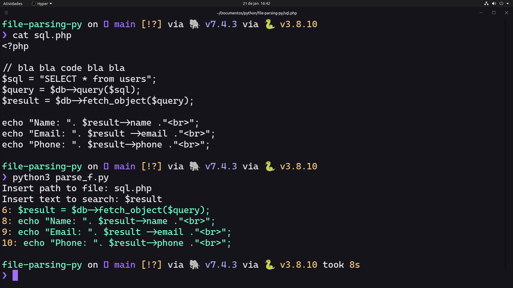

# Parsing text
Almost like a mini-grep.

Initially created to extract used object variables used in php code.

Run 
Type in the relative path to file
The string to search

And will(should) return the full line with line number of what you searched

